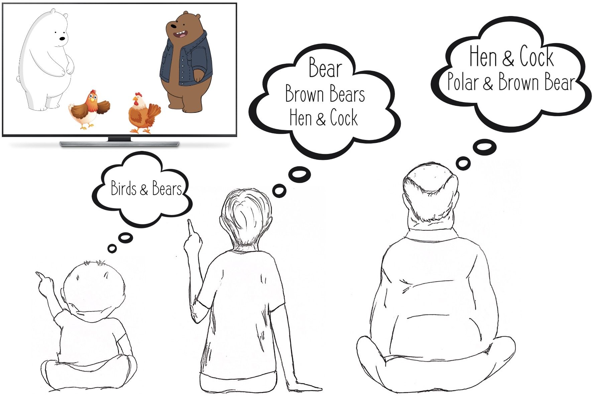

# Mohamed Ashraf Abdelsalam

I work as a Machine Learning Research Engineer at Samsung AI Center (SAIC) Toronto. Before that, I did my Master's in Machine Learning at <a href="mila.quebec/en/"> Mila </a> and the University of Montreal, where I was supervised by <a href="http://sarathchandar.in/">Dr. Sarath Chandar</a> . In 2018, I completed my Bachelor's in Aerospace Engineering from <a href="https://zewailcity.edu.eg/">Zewail University of Science and Technology</a>. Check out my personal <a href="/CV.pdf">CV</a> for more details!

## Research
Broadly speaking, my research interests lie in the field of machine learning and deep learning. Currently, I am primarily focused on multimodal research research in the intersection of vision and language. Additionally, I am also interested in the area of continual learning and the development of flexible models that can accumulate new knowledge, modify existing knowledge, and learn new tasks without forgetting previously acquired knowledge and experiences, even in the absence of data or with limited data available for these prior tasks.

### Publications
 

    

     <a href="https://arxiv.org/abs/2210.14862"><b>Visual Semantic Parsing: From Images to Abstract Meaning Representation</b></a>
      <i><b>Mohamed A. Abdelsalam</b>, Zhan Shi, Federico Fancellu, Kalliopi Basioti, Dhaivat J. Bhatt, Vladimir Pavlovic, Afsaneh Fazly.</i>
      <i>CoNLL</i>, 2022
      The paper proposes a new method for visual scene understanding by using Abstract Meaning Representation (AMR) to create linguistically informed visual AMR graphs that focus on higher-level semantic concepts, and demonstrate the feasibility of the approach through experimentation and analysis.
      

        
     

     <a href="https://arxiv.org/abs/2210.14862"><b>A Brief Study on the Effects of Training Generative Dialogue Models with a Semantic loss</b></a>
      Prasanna Parthasarathi, <b>Mohamed A. Abdelsalam</b>, Joelle Pineau, Sarath Chandar</i>
      <i>SIGDial</i>, 2021
      The study explores the use of an alternate training objective, minimizing a semantic loss as an auxiliary objective, to foster generating alternate responses and improve diversity in next utterance generation in dialogue tasks, with observations showing improvement in diversity in smaller datasets.
        
 

    

     <a href="https://chandar-lab.github.io/IIRC/"><b>IIRC: Incremental Implicitly Refined Classification</b></a>
          
      <i><b>Mohamed A. Abdelsalam</b>, Mojtaba Faramarzi, Shagun Sodhani, Sarath Chandar.</i>
      <i>CVPR</i>, 2021
      A setup and benchmark for evaluating lifelong learning models in more dynamic and realistic scenarios.
      <a href="https://chandar-lab.github.io/IIRC/">Homepage</a> | <a href="https://arxiv.org/abs/2012.12477">arXiv</a> | 
     <a href="https://iirc.readthedocs.io/en/latest/">Documentation</a> | <a href="https://github.com/chandar-lab/IIRC/">Code</a>
    

         
     
### Primers

 <a href="https://arxiv.org/pdf/2207.04354.pdf"><b>An Introduction to Lifelong Supervised Learning</b></a>
  <i>Shagun Sodhani, Mojtaba Faramarzi, Sanket Vaibhav Mehta, Pranshu Malviya, <b>Mohamed A. Abdelsalam</b>, Janarthanan Janarthanan, Sarath Chandar.</i>
  This primer is an attempt to provide a detailed summary of the different aspects of lifelong supervised learning.

